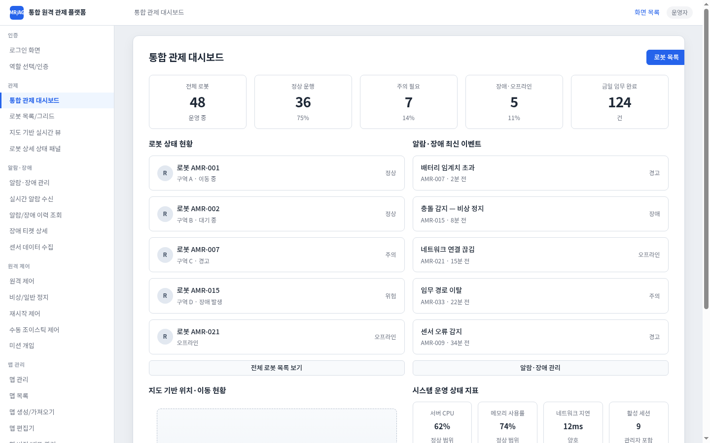
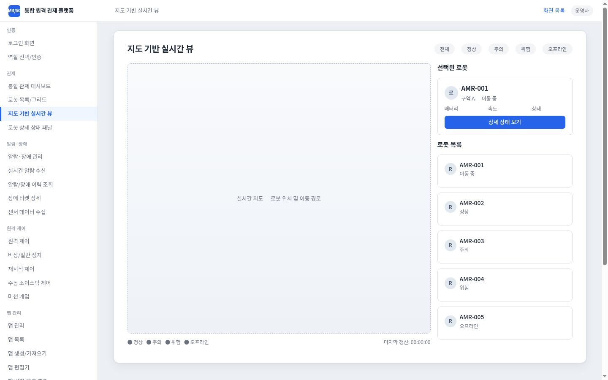
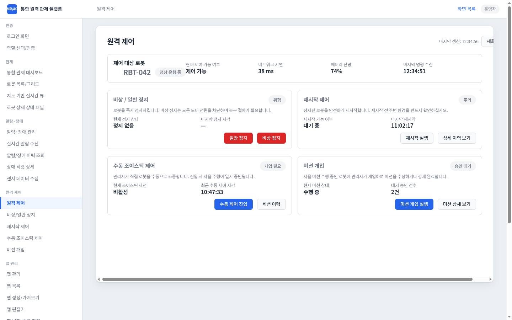
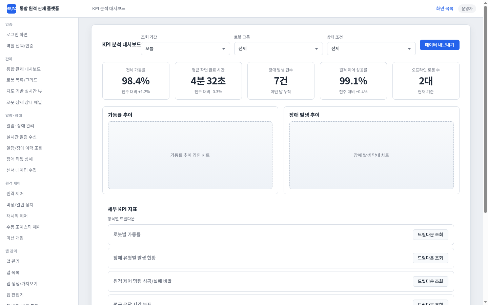

<h1 align="center">RoboOps</h1>

<p align="center">
  <a href="LICENSE"></a>
  
  
  
  <a href="https://github.com/sponsors/kjungmo"></a>
</p>

<p align="center">
Operator console for an <b>AMR/AGV integrated remote fleet-control platform</b> — 30 interactive screens rendered as a navigable React app, driven entirely by design-data JSON committed in this repository.
</p>

<p align="center">
  
</p>

<p align="center">
  <a href="#what-is-roboops">About</a> ·
  <a href="#screens">Screens</a> ·
  <a href="#getting-started">Getting Started</a> ·
  <a href="#data-layout">Data Layout</a> ·
  <a href="#refreshing-the-design-data">Refresh</a> ·
  <a href="#deployment">Deployment</a> ·
  <a href="#roadmap">Roadmap</a> ·
  <a href="#sponsor">Sponsor</a> ·
  <a href="#license">License</a>
</p>

---

## What is RoboOps?

RoboOps is a **local, fully client-side operator console** for an AMR/AGV remote
fleet-control platform. The entire UI — 30 screens, 8 user flows, navigation,
and modal dialogs — is rendered at runtime from [Manyfast](https://manyfast.io)
wireframe JSON stored under [`src/data/`](src/data/), alongside the exported
feature specs (8 requirements · 25 features · 51 specs).

That makes the repository three things at once:

- a **running operator console** you can click through end-to-end (`npm run dev`),
- a **living design document** — the PRD, feature specs, and user flows ship as data next to the code,
- a **wireframe renderer** (`src/wireframe/`) that turns page-tree JSON into React components, wiring `navigate` / `open-modal` / `close` actions between screens.

> **Honest scope** — every number, robot ID, and chart you see is wireframe
> placeholder data. There is no live robot, telemetry, or backend connection yet;
> that adapter layer is on the [roadmap](#roadmap).

## Screens

30 screens across seven functional groups (sidebar order):

| Group | Screens |
|-------|---------|
| 인증 (Auth) | 로그인 화면 · 역할 선택/인증 |
| 관제 (Monitoring) | 통합 관제 대시보드 · 로봇 목록/그리드 · 지도 기반 실시간 뷰 · 로봇 상세 상태 패널 |
| 알람·장애 (Alarms & Faults) | 알람·장애 관리 · 실시간 알람 수신 · 알람/장애 이력 조회 · 장애 티켓 상세 · 센서 데이터 수집 |
| 원격 제어 (Remote Control) | 원격 제어 · 비상/일반 정지 · 재시작 제어 · 수동 조이스틱 제어 · 미션 개입 |
| 맵 관리 (Map Management) | 맵 관리 · 맵 목록 · 맵 생성/가져오기 · 맵 편집기 · 맵 버전/배포 관리 · 경로/목적지 설정 |
| 시스템 관리 (System Admin) | 시스템 관리 · 사용자 계정 관리 · 역할/권한(RBAC) 설정 · 로봇 등록/수정 · 현장·구역 관리 · 연동 헬스체크 |
| 분석 (Analytics) | KPI 분석 대시보드 · 감사 로그 조회 |

| 지도 기반 실시간 뷰 | 원격 제어 |
|:---:|:---:|
|  |  |
| **KPI 분석 대시보드** | |
|  | |

*All values shown are wireframe placeholder data rendered from the committed JSON — not live fleet telemetry.*

## Getting Started

Requires [Node.js](https://nodejs.org/) (LTS).

```bash
npm install
npm run dev
```

Open in your browser:

| URL | Screen |
|-----|--------|
| `http://localhost:5173/page/n2` | 로그인 화면 (default entry) |
| `http://localhost:5173/pages` | Index of all 30 screens |
| `http://localhost:5173/page/n6` | 통합 관제 대시보드 |

`/` redirects to `/page/n2`. Use the **`/page/`** prefix — `/n2` alone will not work.

Buttons with `navigate` actions move between screens; `open-modal` / `close` toggle overlay dialogs.

Production build:

```bash
npm run build
npm run preview      # serves dist/ (default http://localhost:4173)
```

## Data Layout

| Path | Contents |
|------|----------|
| `src/data/manifest.json` | Export metadata (timestamps, counts, project/version IDs) |
| `src/data/summary.json` | Wireframe page index (30 screens) |
| `src/data/project-full.json` | Full Manyfast project blob (`read_project`) |
| `src/data/project-meta.json` | PRD summary markdown + stats (`read_project_meta`) |
| `src/data/feature-specs/` | **기능명세서** — requirements, features, specs, PRD overview, hierarchy index |
| `src/data/pages/*.json` | Per-page wireframe trees from Manyfast |
| `src/data/user-flows/` | **유저플로우** — `list.json` + 8 flow detail exports |

## Refreshing the design data

The design data is exported through the Manyfast MCP server (auth is
session-bound to an MCP-connected editor session — standalone scripts get
HTTP 401). From such a session:

1. Re-fetch project: `read_project` → `project-full.json`; extract `feature-specs/` (requirements, features, specs, index)
2. Re-fetch meta: `read_project_meta` → `project-meta.json`
3. Re-fetch wireframes: `read_wireframe` scope `summary` + scope `page` for each page in `summary.json`
4. Re-fetch user flows: `read_user_flow` mode `list` + mode `detail` for each version → `user-flows/`
5. Update `manifest.json` with `exportedAt` and `manyfastUpdatedAt`

Project and wireframe-version IDs live in [`src/data/manifest.json`](src/data/manifest.json).

## Deployment

RoboOps is a plain static web build — the same `dist/` runs on Linux and Windows; only the delivery differs by audience.

- **Internal URL** — `npm run build` output in `dist/` served by nginx, IIS, or any static host; users open a link in Chrome/Edge.
- **Portable folder** — zip with pre-built `dist/` plus a small `start.bat` / `start.sh` that opens the default browser (no install, but not a native `.exe`).
- **Desktop installer** — planned (see roadmap); the app today is browser-only.

## Roadmap

- [x] 30 wireframe screens navigable end-to-end (`navigate` / modal actions wired)
- [x] Feature specs, PRD summary, and 8 user flows shipped as data alongside the UI
- [ ] Desktop packaging — Tauri or Electron wrapping the `dist/` build, shipped via GitHub Releases
- [ ] Live telemetry adapter — replace placeholder data with a real fleet API
- [ ] English UI locale (screens are currently Korean-first)

## Sponsor

If RoboOps saves you time, consider [sponsoring](https://github.com/sponsors/kjungmo).
Sponsorship funds maintenance, new features, and faster issue response. 💛

## License

Apache License 2.0 — see [LICENSE](LICENSE).

## Acknowledgements

The screen structure, feature specs, and user flows were designed in
[Manyfast](https://manyfast.io) and exported to JSON; the renderer in this
repository turns those exports into a navigable console.
